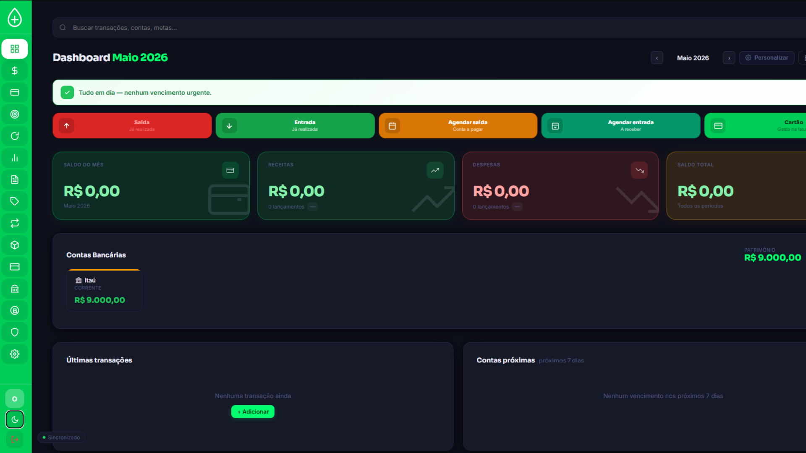

# FinanceOS

Landing page do **FinanceOS**, projeto voltado ao controle financeiro pessoal e empresarial.

O objetivo do projeto é oferecer uma interface clara para centralizar informações como receitas, despesas, metas e relatórios financeiros.

## Sobre o projeto

Esta versão pública apresenta a landing page do FinanceOS e demonstra a proposta visual e funcional do sistema.

O projeto foi desenvolvido com foco em:

- Interface responsiva
- Experiência de usuário
- Apresentação de funcionalidades
- Organização visual de informações financeiras
- Conversão de visitantes em usuários do sistema

## Tecnologias

- HTML5
- CSS3
- JavaScript
- Design responsivo
- Deploy web

## Funcionalidades apresentadas

- Controle de receitas e despesas
- Acompanhamento de metas
- Relatórios financeiros
- Visão geral das informações financeiras
- Interface responsiva para diferentes dispositivos

## Preview



## Estrutura do repositório

```text
financeos-landing/
├── index.html
├── dashboard.png
└── README.md
```

## Objetivo técnico

Este projeto faz parte do meu portfólio de desenvolvimento de sistemas e demonstra a criação de uma interface web voltada a um produto real.

Além da parte visual, o FinanceOS serve como base para aprofundamento em desenvolvimento de sistemas, regras de negócio, bancos de dados e automação.

## Autor

**Gabriel Santos**  
Analista de Sistemas | Análise e Desenvolvimento de Sistemas

- GitHub: https://github.com/ogabrieltech
- LinkedIn: https://linkedin.com/in/gabriel-santos-708aa1154
- E-mail: gabrieltechbr.pm.me
